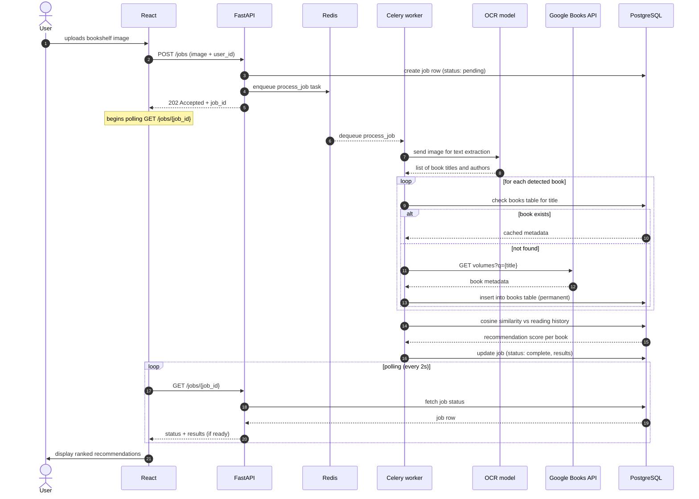

```mermaid
sequenceDiagram
  autonumber
  actor User
  participant React
  participant FastAPI
  participant Redis
  participant Worker as Celery worker
  participant OCR as OCR model
  participant GBooks as Google Books API
  participant PG as PostgreSQL

  User->>React: uploads bookshelf image
  React->>FastAPI: POST /jobs (image + user_id)
  FastAPI->>PG: create job row (status: pending)
  FastAPI->>Redis: enqueue process_job task
  FastAPI-->>React: 202 Accepted + job_id

  Note over React: begins polling GET /jobs/{job_id}

  Redis-->>Worker: dequeue process_job
  Worker->>OCR: send image for text extraction
  OCR-->>Worker: list of book titles and authors

  loop for each detected book
    Worker->>PG: check books table for title
    alt book exists
      PG-->>Worker: cached metadata
    else not found
      Worker->>GBooks: GET volumes?q={title}
      GBooks-->>Worker: book metadata
      Worker->>PG: insert into books table (permanent)
    end
  end

  Worker->>PG: cosine similarity vs reading history
  PG-->>Worker: recommendation score per book
  Worker->>PG: update job (status: complete, results)

  loop polling (every 2s)
    React->>FastAPI: GET /jobs/{job_id}
    FastAPI->>PG: fetch job status
    PG-->>FastAPI: job row
    FastAPI-->>React: status + results (if ready)
  end

  React->>User: display ranked recommendations
```